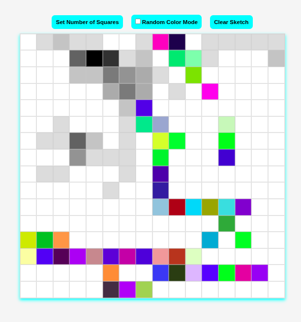

# Etch-a-Sketch 🎨

A simple browser-based sketchpad.
Draw by hovering over grid squares and watch the canvas come to life with black or random colors.

## 🚀 Features

- 🎨 **Hover to Draw**: Color squares by simply hovering your mouse.
- 🔢 **Custom Grid Size**: Choose how many squares per side (up to 100×100).
- 🌈 **Random Color Mode**: Toggle random colors for more creative fun.
- 🌑 **Progressive Darkening**: In standard mode, squares darken with each hover.
- ♻️ **Clear Button**: Reset the sketchpad to a blank slate anytime.

## 🛠️ Tech Stack

- **HTML**
- **CSS**
- **JavaScript**

No libraries or frameworks — just pure vanilla JavaScript and CSS.

## 📸 Demo



## 🧩 How It Works

1. A grid of square divs is dynamically generated.
2. Mouse hover events color the squares.
3. You can:
   - Resize the grid with a prompt.
   - Toggle between black and random color mode.
   - Clear the grid with one click.

## 🎯 Getting Started

### Online

To play the game online, just head over to this [link](https://quxpta.github.io/odin-etch-a-sketch/), and play away!

### Offline

If you would like to play the game offline:

```bash
git clone https://github.com/QUxPTA/odin-etch-a-sketch
cd odin-etch-a-sketch
```

Then, drop the HTML file into your browser of choice, or open using liveserver in your favorite IDE

## 🧠 Concepts Practiced

- DOM manipulation
- Event listeners
- CSS transitions
- Grid layout using Flexbox
- Dynamic user input and validation

## 🙌 Credits

Built as part of [The Odin Project](https://www.theodinproject.com/) curriculum.
